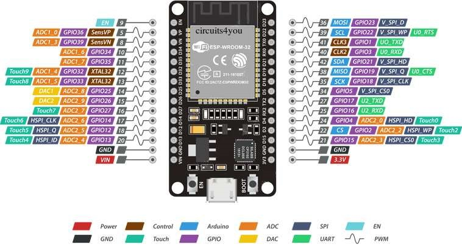
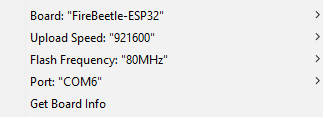

# ESP32 display HTTP POST 

## [Main resource](https://techtutorialsx.com/2018/10/12/esp32-http-web-server-handling-body-data/)

### This project is dedicated to using esp32 as web server and handling the HTTP POST requests.It should display the message in the raw body of post.
 

## Libraries needed to add to project in Arduino ide:

- [ESPAsyncWebServer](https://github.com/me-no-dev/ESPAsyncWebServer)
- [AsyncTCP - for ESP32](https://github.com/me-no-dev/AsyncTCP)
- [ESPAsyncTCP - for ESP8266](https://github.com/me-no-dev/ESPAsyncTCP)
- ArduinoJson 6.18 in Arduino IDE
I used OLED 0.96 128x64 and libreries were:
- Arduino SSD1306
- Arduino GFX
  
### I used ESP32 with included pinout

 

### Settings of Tools:

I connected display to 3.3V and GND with SCL and SDA 